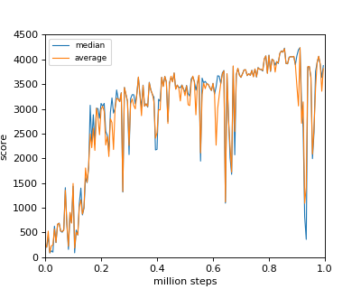
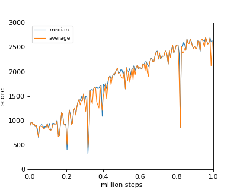

# chainer-td3
Reproduction codes of Twin Delayed Deep Deterministic policy gradient (TD3) with chainer

# About

This repo is a TD3 reproduction codes writen with chainer. [See this original paper](http://proceedings.mlr.press/v80/fujimoto18a/fujimoto18a.pdf) for details

# Results

May require to export below variable before running the code in linux environment. 

```
$ export LD_PRELOAD=/usr/lib/x86_64-linux-gnu/libGLEW.so
```

## Walker2d-v2

```sh
$ python3 main.py --test-run --pi-params=trained_results/mujoco/walker2d-v2/pi_final_model
```

|result|score|
|:---:|:---:|
|  ||

## Ant-v2


```sh
$ python3 main.py --test-run --pi-params=trained_results/mujoco/ant-v2/pi_final_model
```

|result|score|
|:---:|:---:|
|  ||
